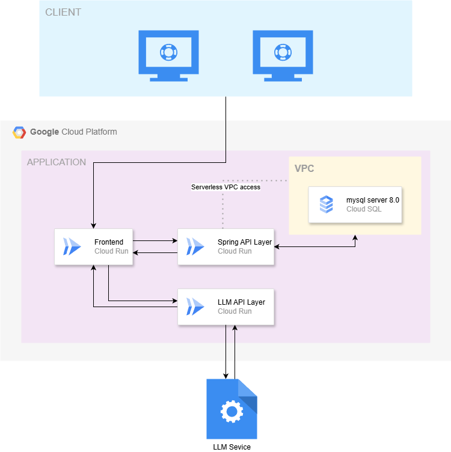

## 🌐 Introduction

**Dishcraft** is a full-stack, three-layer web application designed to deliver a seamless and intelligent user experience through a modern tech stack. Built with a React-based frontend, a robust Spring Boot API server, and a Python-powered LLM API endpoint, Dishcraft leverages a MySQL relational database to manage structured data efficiently.

The system architecture separates concerns into three distinct layers:

- **Frontend (React)**: A responsive and interactive user interface that communicates with backend services via REST APIs.
- **Backend (Spring Boot)**: A scalable and secure API server that handles business logic, authentication, and database operations.
- **AI Layer (Python LLM)**: A dedicated service that provides natural language processing capabilities, offering intelligent features powered by large language models.

Dishcraft is designed with modularity, scalability, and maintainability in mind, making it ideal for teams looking to integrate AI-enhanced features into a traditional web application framework.

## 🎯 Purpose

**Dishcraft** is an AI-powered recipe platform designed to enhance the cooking experience by offering intelligent ingredient suggestions and detailed, personalized cooking instructions.

The goal of this project is to:

- Provide users with alternative ingredient suggestions based on what they have at home or dietary preferences.
- Generate step-by-step cooking instructions using AI, based on minimal recipe data stored in the database.
- Offer a lightweight, scalable solution for managing and enhancing recipe content using large language models (LLMs).

The backend database stores essential recipe data, including:

- Cooking time  
- Short description  
- Required ingredients  
- Concise cooking instructions  

From this minimal data, Dishcraft leverages AI to deliver a richer, more interactive and adaptive cooking assistant experience.

## 🧩 Backend (Spring Boot)

The backend of **Dishcraft** is built with **Spring Boot**, serving as the core API layer that manages recipes, ingredients, and user authentication. It provides structured data to the frontend and supports AI-based enhancement via minimal, clean endpoints.

This layer ensures secure, modular, and scalable data management for the application.

### 🔧 Responsibilities

- Exposes RESTful APIs for recipe and ingredient management
- Supports flexible recipe search by ingredient filters and modes
- Handles user authentication and token-based authorization using JWT
- Provides structured data (recipe titles, ingredients, short instructions) to the frontend for AI-powered enhancement
- Manages admin-level (root) permissions for content modification

### ⚙️ Tech Stack

- **Spring Boot**
- **Spring Web** (RESTful API)
- **Spring Data JPA** (MySQL)
- **Spring Security + JWT**
- **Swagger / SpringDoc** for API documentation

### 📌 Core Features

- **Recipe Management**: Create, update, delete, view recipes
- **Ingredient Management**: Add, update, delete, and search ingredients
- **Search API**: Filter recipes by selected ingredient IDs and mode (`all` / `any`)
- **User Authentication**: Register, login, refresh token via secure JWT handling
- **Pagination Support**: Use Spring's `Pageable` for paginated recipe queries
- **Swagger API Docs**: Interactive documentation accessible via `/swagger-ui.html`

> Only users with **root** privileges are allowed to create, modify, or delete content.

### 🔐 Security & Roles

- JWT-based authentication and stateless session handling
- Admin role (`root`) enforced on protected endpoints
- Token refresh supported via a dedicated endpoint

### 🛠️ Environment Configuration

Dishcraft's backend is configurable for multiple environments. All key properties (e.g., database credentials, JWT secrets, CORS settings, etc.) can be overridden using **environment variables**, enabling secure and flexible deployment.

> For example, in production:
> - `JWT_SECRET`
> - `SPRING_DATASOURCE_PASSWORD`
> - `SPRING_DATASOURCE_URL`
> - `SPRING_DATASOURCE_USERNAME`
> - `CORS_ALLOWED_ORIGINS`
> - `OPENAPI_SERVER_URL`

This allows the application to run smoothly across local, development, and production environments without changing source code.

### Prerequisite
this git is configured as the runs in development environment require mysql runs in default port which has user root with pw root 

---
This backend service forms the foundation of the Dishcraft application, providing clean APIs and secure data handling while supporting integration with intelligent frontend and AI services.

## 💻 Frontend (React + Nginx)

The frontend of **Dishcraft** is built with **React** and follows a **Multi-Page Application (MPA) structure**, where different sections of the website are served as separate HTML files. The final production build is served using **Nginx** inside a Docker container.

### 🧭 Responsibilities

- Display recipe lists, details, and ingredient information via REST API calls.
- Allow users to search for recipes by selecting multiple ingredients.
- Communicate with the **Python LLM API** to:
  - Suggest alternative ingredients.
  - Generate detailed, AI-powered cooking instructions.
- Handle JWT-based user authentication and authorization.
- Provide an intuitive and responsive UI/UX optimized for desktop and mobile.

### ⚙️ Tech Stack

- **React** (User Interface)
- **CSS & HTML** (Page structure and styling)
- **Axios** (API communication)
- **JWT handling** (Authentication & authorization)
- **Nginx** (Production static file hosting)

### 🚀 Deployment Workflow

1. The React application is built using a lightweight Node.js environment.
2. The build output (static HTML, CSS, and JavaScript files) is transferred to an **Nginx container**.
3. Nginx serves these static files efficiently and handles client requests.

### ⚠️ API Endpoint Configuration

Before deploying the frontend, **API endpoint values must be updated** in the React code to ensure it connects to the correct backend server.

- API URLs are currently **hardcoded** in files handling API requests.
- These include recipe retrieval, ingredient search, and user authentication functions.
- **Planned improvement:** API URLs will be managed using environment variables in a future update for easier configuration across different environments.

---

The frontend is fully decoupled from the backend, allowing for flexible deployment and easy integration with AI-powered enhancements.

## 🧠 AI Layer (Python LLM API)

The AI component of **Dishcraft** is implemented as a lightweight Flask server that interacts with Google’s Gemini model via the Generative AI SDK. Its purpose is to enrich basic recipe data by generating:

- Step-by-step cooking instructions
- Ingredient substitutions based on user inventory

### 🎯 Key Responsibilities

- Receive structured recipe input (title, ingredients, available ingredients, and short description)
- Generate a consistent AI-powered response to guide the cooking process
- Adjust instructions based on missing or substituted ingredients

### 📌 Endpoints Used

- `POST /start`  
  Starts a new LLM session with user input. This is the **only** endpoint currently used by the Dishcraft frontend.

> Other endpoints like `/continue` and `/clear` exist for managing session state, but are not actively used in the current implementation.

### ⚙️ Tech Stack

- **Flask** (Web server)
- **Flasgger** (Swagger integration for API docs)
- **Google Generative AI SDK** (Gemini model)
- **Flask-CORS** (for cross-origin frontend access)

### ⚙️ Environment Configuration

- **CORS origins** are configured through the `CORS` environment variable  
  (default: `http://localhost:3000` for local React development)
- The Gemini API key is currently embedded in the code for development purposes, but it will be moved to environment variable management in a future version to enhance security and flexibility.

---

This AI layer operates independently from the main backend and is designed to be stateless and easily replaceable or extendable.

## 🗂 System Architecture Overview

The overall system is deployed on **Google Cloud Platform**, using Cloud Run for all service layers. The architecture follows a modular, decoupled design with three main components:

- **Frontend (React + Nginx)**: Served via Cloud Run, delivers the UI and communicates with the backend and AI service.
- **Spring API Layer**: The core backend, responsible for recipe/ingredient data handling and database interaction.
- **LLM API Layer (Python)**: A stateless AI module that uses Gemini to generate detailed cooking instructions and ingredient substitutions.
- **MySQL Cloud SQL**: Managed database connected to the API layer via Serverless VPC access.

### 🖼 Architecture Diagram

### 🔄 Data Flow Summary

1. The **client** sends requests through the frontend.
2. The **frontend** interacts with:
   - The **Spring API Layer** for data (recipes, ingredients, auth)
   - The **LLM API Layer** for AI-enhanced instructions
3. The **Spring API Layer** accesses **Cloud SQL** to persist and retrieve structured data.
4. The **LLM API Layer** sends requests to the **LLM service** (Google Gemini) and returns results to the frontend.

## 🚀 Live Demo

You can check out the live version of **Dishcraft** here:

🔗 **[Dishcraft Live Demo](https://dishcraft-fe-414213457313.us-central1.run.app/)**

This deployment runs on **Google Cloud Run** and connects to the full backend and AI services.

## ⚖️ License

This project is a university assignment and is **not licensed for public or commercial use**.  
Unauthorized use, distribution, or modification of this code is prohibited.